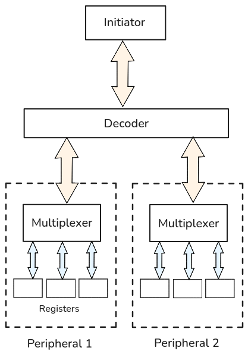

CSR bus
-------

.. py:module:: amaranth_soc.csr.bus

The :mod:`amaranth_soc.csr.bus` module contains primitives to implement and access the registers of peripherals through a bus interface.

.. testsetup::

   from amaranth import *
   from amaranth.lib import wiring
   from amaranth.lib.wiring import In, Out, flipped, connect

   from amaranth_soc import csr
   from amaranth_soc.memory import *

.. _csr-bus-introduction:

Introduction
============

Overview
++++++++

The CSR bus API provides unopinionated primitives for defining and connecting the *Control and Status Registers* of SoC peripherals, with an emphasis on safety and resource efficiency. It is composed of low-level :ref:`register interfaces <csr-bus-element>`, :ref:`multiplexers <csr-bus-multiplexer>` that provide access to the registers of a peripheral, and :ref:`bus decoders <csr-bus-decoder>` that provide access to subordinate bus interfaces.

This diagram shows a CSR bus decoder being used to provide access to the registers of two peripherals:

Examples
========

.. _csr-bus-element:

Defining registers
++++++++++++++++++

A CSR register is a :class:`~amaranth.lib.wiring.Component` with an :class:`Element` member in its interface, oriented as input and named ``"element"``.

For example, this component is a read/write register with a configurable width:

.. testcode::

   class MyRegister(wiring.Component):
       def __init__(self, width):
           super().__init__({
               "element": In(csr.Element.Signature(width, "rw")),
               "data": Out(width),
           })

       def elaborate(self, platform):
           m = Module()
           storage = Signal.like(self.data)

           with m.If(self.element.w_stb):
               m.d.sync += storage.eq(self.element.w_data)

           m.d.comb += [
               self.element.r_data.eq(storage),
               self.data.eq(storage),
           ]

           return m

CSR bus transactions go through the :class:`Element` port and always target the entire register. Transactions are completed in one clock cycle, regardless of the register width. A read and a write access can be part of the same transaction.

.. _csr-bus-multiplexer:

Accessing registers
+++++++++++++++++++

A :class:`Multiplexer` can provide access to the registers of a peripheral through a CSR bus :class:`Interface`. Registers must first be added to a :class:`MemoryMap`, which is used to instantiate the multiplexer.

The following example shows a very basic timer peripheral with an 8-bit CSR bus and two 24-bit registers, ``Cnt`` and ``Rst``. The value of ``Cnt`` is incremented every clock cycle, and can be reset by a CSR bus write to ``Rst``:

.. testcode::

   class BasicTimer(wiring.Component):
       class Cnt(wiring.Component):
           element: In(csr.Element.Signature(width=24, access="r"))
           r_stb:   Out(1)
           r_data:  In(unsigned(24))

           def elaborate(self, platform):
               m = Module()
               m.d.comb += [
                   self.r_stb.eq(self.element.r_stb),
                   self.element.r_data.eq(self.r_data),
               ]
               return m

       class Rst(wiring.Component):
           element: In(csr.Element.Signature(width=24, access="w"))
           w_stb:   Out(1)
           w_data:  Out(unsigned(24))

           def elaborate(self, platform):
               m = Module()
               m.d.comb += [
                   self.w_stb.eq(self.element.w_stb),
                   self.w_data.eq(self.element.w_data),
               ]
               return m

       def __init__(self):
           super().__init__({
               "csr_bus": In(csr.Signature(addr_width=3, data_width=8)),
           })

           self._reg_cnt = self.Cnt()
           self._reg_rst = self.Rst()

           self.csr_bus.memory_map = MemoryMap(addr_width=3, data_width=8, alignment=2)
           self.csr_bus.memory_map.add_resource(self._reg_cnt, size=3, name=("cnt",))
           self.csr_bus.memory_map.add_resource(self._reg_rst, size=3, name=("rst",))

           self._csr_mux = csr.Multiplexer(self.csr_bus.memory_map)

       def elaborate(self, platform):
           m = Module()
           m.submodules.reg_cnt = self._reg_cnt
           m.submodules.reg_rst = self._reg_rst
           m.submodules.csr_mux = self._csr_mux

           connect(m, flipped(self.csr_bus), self._csr_mux.bus)

           count = Signal(unsigned(24))

           m.d.comb += self._reg_cnt.r_data.eq(count)

           with m.If(self._reg_rst.w_stb):
               m.d.sync += count.eq(self._reg_rst.w_data)
           with m.Else():
               m.d.sync += count.eq(count + 1)

           return m

.. doctest::

   >>> timer = BasicTimer()
   >>> for res_info in timer.csr_bus.memory_map.all_resources():
   ...     print(res_info)
   ResourceInfo(path=(Name('cnt'),), start=0x0, end=0x4, width=8)
   ResourceInfo(path=(Name('rst'),), start=0x4, end=0x8, width=8)

Registers are always accessed atomically, regardless of their size. Each register is split into chunks according to the CSR bus data width, and each chunk is assigned a consecutive address on the bus.

In this example, the sizes of ``Cnt`` and ``Rst`` are extended from 24 to 32 bits, because they were added to ``csr_bus.memory_map`` with an :ref:`alignment <memory-alignment>` of 32 bits.

The following diagram shows a read transaction from the ``Cnt`` register:

.. wavedrom:: csr/bus/example_mux_read

   {
       "head": {
           "tick": 0
       },
       "signal": [
           {"name": "clk", "wave": "p......"},
           {"node": ".AB...C"},
           ["csr_bus",
               {"name": "addr",   "wave": "x====x.",
                "data": [0, 1, 2, 3]},
               {"name": "r_stb",  "wave": "01...0."},
               {"name": "r_data", "wave": "0.45670", "node": "..1234.",
                "data": ["0x01", "0x00", "0xa5", "0x00"]}
           ],
           {},
           ["csr_mux",
               {"name": "r_shadow", "wave": "x.3...x", "node": "..b....",
                "data": ["0xa50001"]}
           ],
           {},
           ["reg_cnt",
               {"name": "r_stb",  "wave": "010...."},
               {"name": "r_data", "wave": "=3=====", "node": ".a.....",
                "data": ["0xa50000", "0xa50001", "0xa50002", "0xa50003",
                         "0xa50004", "0xa50005", "0xa50006"]}
           ]
       ],
       "edge": [
           "A+B t1",
           "a-~>b",
           "B+C t2",
           "b~>1"
       ],
       "config": {
           "hscale": 2
       }
   }

The :class:`Multiplexer` adds a delay of 1 clock cycle to CSR bus reads (represented by *t1*) between the time of assertion of ``csr_bus.r_stb`` and the time the first chunk is transmitted to ``csr_bus.r_data``.

A read transaction targeting ``Cnt`` requires 4 bus reads to complete and has a latency of 4 clock cycles (represented by *t2*).

When the first chunk of ``Cnt`` is read, the value of all of its chunks (at point labelled *a*) is captured by a shadow register internal to the multiplexer (at point labelled *b*). Reads from any chunk return the captured values (at points labelled *1*, *2*, *3*, *4*).

The following diagram shows a write transaction to the ``Rst`` register, which resets the value of the ``Cnt`` register as a side-effect:

.. wavedrom:: csr/bus/example_mux_write

   {
       "head": {
           "tick": 0
       },
       "signal": [
           {"name": "clk", "wave": "p......"},
           {"node": ".A...BC"},
           ["csr_bus",
               {"name": "addr",   "wave": "x====x.",
                "data": [4, 5, 6, 7]},
               {"name": "w_stb",  "wave": "01...0."},
               {"name": "w_data", "wave": "x4567x.", "node": ".1234..",
                "data": ["0x44", "0x55", "0x66", "0x00"]}
           ],
           {},
           ["csr_mux",
               {"name": "w_shadow", "wave": "x.===3x", "node": "..a..b",
                "data": ["0x000044", "0x005544", "0x665544", "0x665544"]}
           ],
           {},
           ["reg_rst",
               {"name": "w_stb",  "wave": "0....10"},
               {"name": "w_data", "wave": "x....3x", "node": ".....c.",
                "data": ["0x665544"]}
           ],
           {},
           ["reg_cnt",
               {"name": "r_data", "wave": "======3", "node": "......d",
                "data": ["0xa50007", "0xa50008", "0xa50009", "0xa5000a",
                         "0xa5000b", "0xa5000c", "0x665544"]}
           ],
           {}
       ],
       "edge": [
           "A+B t1",
           "1~->a",
           "B+C t2",
           "b~->c", "c~->d"
       ],
       "config": {
           "hscale": 2
       }
   }

A write transaction targeting ``Rst`` requires 4 bus writes to complete and has a latency of 4 clock cycles (represented by *t1*).

When a chunk of ``Rst`` is written (at point labelled *1*), the written value is captured by a shadow register internal to the multiplexer (at point labelled *a*). A write to the last chunk (at point labelled *4*) causes all captured values to be written to the register (at point labelled *c*).

The :class:`Multiplexer` adds a delay of 1 clock cycle to CSR bus writes (represented by *t2*) between the time of assertion of ``csr_bus.w_stb`` and the time of assertion of ``reg_rst.w_stb``.

As a side-effect of the transaction, the next value of ``Cnt`` becomes the value that was written to ``Rst`` (at point labelled *d*).

.. warning::

   To safely access registers over the bus interface of a :class:`Multiplexer`, the following
   rules apply:

        1. the bus initiator must have exclusive ownership over the address range of the multiplexer until the register transaction is either completed or aborted.
        2. the bus initiator must access a register in ascending order of addresses, but it may abort the transaction after any bus cycle.

.. _csr-bus-decoder:

Accessing a hierarchy of registers
++++++++++++++++++++++++++++++++++

A :class:`Decoder` can provide access to group of :class:`Multiplexer`\ s and subordinate :class:`Decoder`\ s, forming a hierarchical address space of CSR registers.

In the following example, a CSR decoder provides access to the registers of two peripherals:

.. testcode::

   timer0 = BasicTimer()
   timer1 = BasicTimer()

   csr_dec = csr.Decoder(addr_width=16, data_width=8)
   csr_dec.add(timer0.csr_bus, addr=0x0000, name="timer0")
   csr_dec.add(timer1.csr_bus, addr=0x1000, name="timer1")

.. doctest::

   >>> for res_info in csr_dec.bus.memory_map.all_resources():
   ...     print(res_info)
   ResourceInfo(path=(Name('timer0'), Name('cnt')), start=0x0, end=0x4, width=8)
   ResourceInfo(path=(Name('timer0'), Name('rst')), start=0x4, end=0x8, width=8)
   ResourceInfo(path=(Name('timer1'), Name('cnt')), start=0x1000, end=0x1004, width=8)
   ResourceInfo(path=(Name('timer1'), Name('rst')), start=0x1004, end=0x1008, width=8)

Although there is no functional difference between adding a group of registers directly to a :class:`Multiplexer` and adding them to multiple :class:`Multiplexer`\ s that are aggregated with a :class:`Decoder`, hierarchical CSR buses are useful for organizing a hierarchical design.

If many peripherals are directly served by a single :class:`Multiplexer`, a very large amount of ports will connect the peripheral registers to the multiplexer, and the cost of decoding logic would not be attributed to specific peripherals. With a :class:`Decoder`, only five signals per peripheral will be used, and the logic could be kept together with the peripheral.

Register interfaces
===================

.. autoclass:: amaranth_soc.csr.bus::Element.Access()
   :no-members:

   .. autoattribute:: amaranth_soc.csr.bus::Element.Access.R
   .. autoattribute:: amaranth_soc.csr.bus::Element.Access.W
   .. autoattribute:: amaranth_soc.csr.bus::Element.Access.RW
   .. automethod:: amaranth_soc.csr.bus::Element.Access.readable
   .. automethod:: amaranth_soc.csr.bus::Element.Access.writable

.. autoclass:: amaranth_soc.csr.bus::Element.Signature()
   :no-members:

   .. automethod:: amaranth_soc.csr.bus::Element.Signature.create
   .. automethod:: amaranth_soc.csr.bus::Element.Signature.__eq__

.. autoclass:: Element()
   :no-members:

.. _csr-bus-interface:

Bus interfaces
==============

.. autoclass:: Signature()
   :no-members:

   .. automethod:: create
   .. automethod:: __eq__

.. autoclass:: Interface()
   :no-members:

   .. autoattribute:: memory_map

Bus primitives
==============

.. autoclass:: Multiplexer()
   :no-members:

.. autoclass:: Decoder()
   :no-members:

   .. automethod:: align_to
   .. automethod:: add
